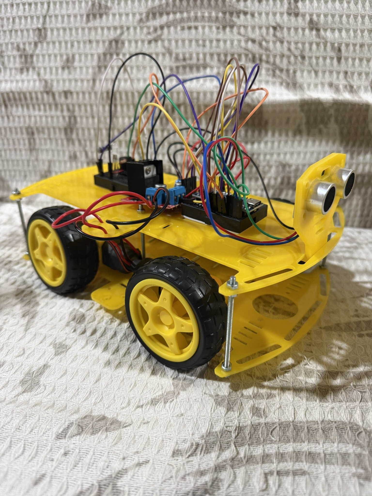

# Arduino Robotics Projects

Hands-on embedded systems and robotics experiments using Arduino. Focused on building functional prototypes with sensors, motors, and wireless control — great foundation for Mechatronics (sensor-actuator integration, real-time decision making, motor control).

## Projects Included

### 1. Bluetooth-Controlled Car
**Description**: 4-wheel robot car controlled wirelessly via Bluetooth from a smartphone app (e.g., Arduino Bluetooth Controller). Uses HC-06 module + L298N driver for direction and speed.

**Features**:
- Forward/backward, left/right turning
- Variable speed control via PWM

**Hardware**:
- Arduino Nano (or Uno)
- L298N motor driver
- 4 DC motors + chassis
- HC-06 Bluetooth module
- Li-ion battery pack

**Pin Connections**:
| Component       | Pin(s)              | Arduino Pin |
|-----------------|---------------------|-------------|
| L298N IN1       | Motor direction     | 4           |
| L298N IN2       | Motor direction     | 5           |
| L298N IN3       | Motor direction     | 6           |
| L298N IN4       | Motor direction     | 7           |
| L298N ENA       | PWM speed left      | 3           |
| L298N ENB       | PWM speed right     | 9           |
| HC-06 TX        | Serial RX           | RX (or 0)   |
| HC-06 RX        | Serial TX           | TX (or 1)   |

**Code**: `car_bluetooth.ino` — Reads serial commands (e.g., 'F' for forward) and maps to motor pins.

**Demo Video**:
<video src="Bluetooth%20Car%20Driver.MOV" controls width="600"></video>

### 2. Ultrasonic Obstacle-Avoiding Car
**Description**: Autonomous robot that measures distance with HC-SR04 ultrasonic sensor, stops/turns when obstacle < 20 cm, and provides feedback with RGB LED (green = clear, red = obstacle) + buzzer.

**Features**:
- Continuous distance measurement
- Avoidance logic (stop + turn)
- Visual (RGB) and audio (buzzer) alerts

**Hardware**:
- Same chassis/motors/L298N as above
- HC-SR04 ultrasonic sensor
- Common-anode RGB LED
- Active buzzer

**Pin Connections**:
| Component       | Pin(s)              | Arduino Pin |
|-----------------|---------------------|-------------|
| HC-SR04 Trig    | Trigger pulse       | 11          |
| HC-SR04 Echo    | Echo pulse          | 10          |
| RGB Red         | Red channel         | 8           |
| RGB Green       | Green channel       | 12          |
| Buzzer          | Positive            | 2           |

**Code**: `car_ultrasonic.ino` — Uses pulseIn() or NewPing for distance, simple if-else for avoidance + LED/buzzer control.

**Demo Video**:
<video src="UltrasonicCar.MOV" controls width="600"></video>

## Circuit Overview
The two projects share the same base chassis and L298N driver for motors. Bluetooth car focuses on wireless input; ultrasonic adds sensor + feedback.

**Real-life prototype photo** (messy but functional!):  
  <!-- Replace with your actual filename once uploaded -->

For clean schematics, similar setups are common (e.g., L298N + HC-SR04 + Bluetooth on breadboard or PCB). You can recreate this in free Fritzing software if desired.

## How to Run / Replicate
1. Install Arduino IDE and upload the .ino file to your board.
2. Wire components exactly as per the pin tables above (double-check polarity for motors/LED/buzzer!).
3. Power with stable 7–12V source (Li-ion or 9V).
4. For Bluetooth: Pair HC-06 with phone (default password usually 1234 or 0000), use app to send commands.
5. Test ultrasonic separately first to calibrate distance threshold.

## What I Learned & Challenges Overcome
- Reliable serial parsing for Bluetooth commands (handling noise/delays).
- Ultrasonic sensor timing and filtering false readings (e.g., using average or timeout).
- Integrating multiple actuators (motors + RGB + buzzer) without blocking code.
- Hardware debugging: Loose wires, power drops, pin conflicts — improved my practical troubleshooting skills for real Mechatronics systems.

These projects sparked my interest in autonomous robots and sensor fusion — excited to build more complex versions!

Happy building! Questions or improvements? Fork or reach out 🤖
