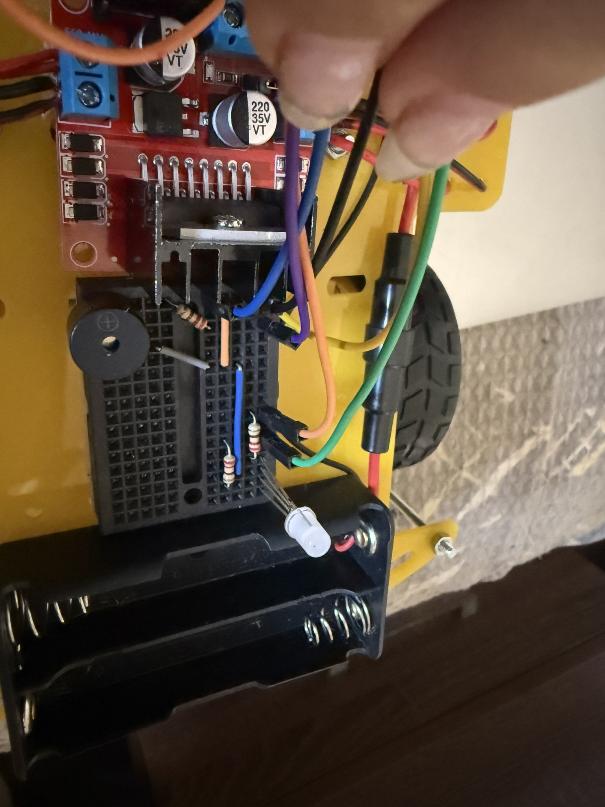
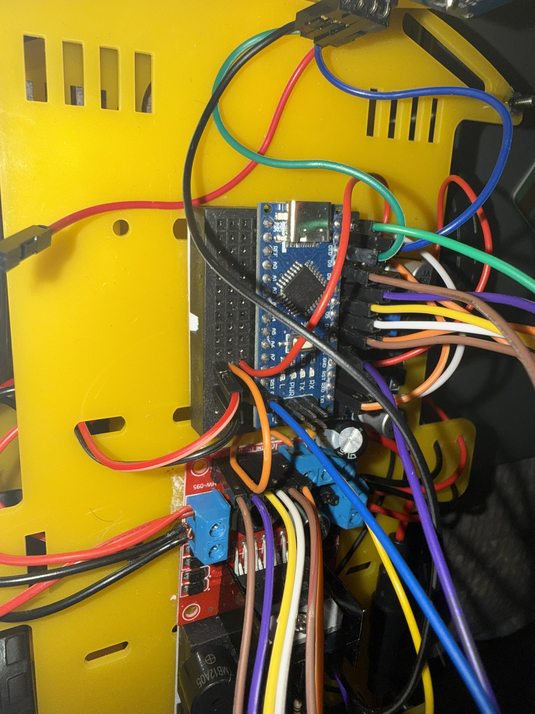
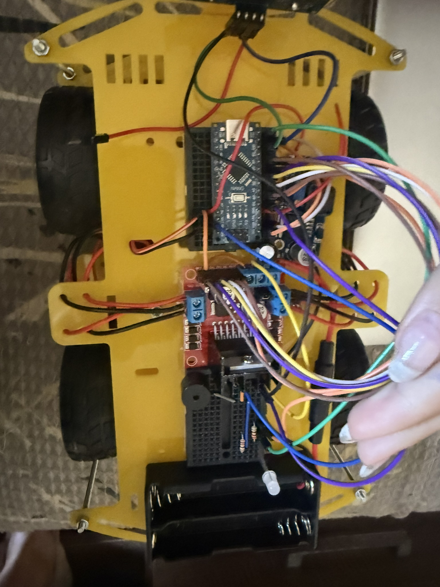

# Arduino Robotics Projects

Hands-on embedded systems and robotics experiments using Arduino. Focused on building functional prototypes with sensors, motors, and wireless control.

These two projects share the same chassis and L298N motor driver: one adds Bluetooth for manual control, the other ultrasonic sensing for autonomous obstacle avoidance with RGB LED and buzzer feedback.

## Projects Included

### 1. Bluetooth-Controlled Car
**Description**: 4-wheel robot car controlled wirelessly via Bluetooth from a smartphone app (Arduino Bluetooth Controller). Uses HC-06 module + L298N driver for direction and speed.

**Features**:
- Forward/backward, left/right turning

**Hardware**:
- Arduino Nano
- L298N motor driver
- 4 DC motors + chassis
- HC-06 Bluetooth module
- Li-ion battery pack

**Pin Connections**:
| Component       | Arduino Pin |
|-----------------|-------------|
| L298N IN1       | 4           |
| L298N IN2       | 5           |
| L298N IN3       | 6           |
| L298N IN4       | 7           |
| L298N ENA (PWM) | 3           |
| L298N ENB (PWM) | 9           |
| HC-06 TX/RX     | Serial (RX/TX) |

**Code**: `car_bluetooth.ino` — Reads serial commands (e.g., 'F' for forward) and maps to motor pins.

**Demo**: [Bluetooth Car Driver.MOV](Bluetooth%20Car%20Driver.MOV)

### 2. Ultrasonic Obstacle-Avoiding Car
**Description**: Autonomous robot using HC-SR04 to detect obstacles (<20 cm) and avoid by turning. Includes RGB LED (green = clear, red = obstacle) + buzzer alert.

**Features**:
- Continuous distance measurement
- Stop/turn logic
- Visual (RGB) and audio (buzzer) feedback

**Hardware**:
- Same chassis/motors/L298N as above
- HC-SR04 ultrasonic sensor
- Common-cathode RGB LED
- Active buzzer

**Pin Connections**:
| Component       | Arduino Pin |
|-----------------|-------------|
| HC-SR04 Trig    | 11          |
| HC-SR04 Echo    | 10          |
| RGB Red         | 8           |
| RGB Green       | 12          |
| Buzzer          | 2           |

**Code**: `car_ultrasonic.ino` — Uses pulseIn() for distance, if-else avoidance + LED/buzzer control.

**Demo**: [Ultrasonic Car.MOV](UltrasonicCar.MOV)

## Circuit Overview & Real Photos
The setup is mounted on a yellow robot chassis with breadboard prototyping.

**Real-life prototype photos** (messy wires, but it works perfectly!):  
  
  

## How to Run / Replicate
1. Install Arduino IDE and upload the .ino file to your board.
2. Wire components exactly as per the pin tables (double-check polarity for motors, RGB, buzzer!).
3. Power with stable 7–12V source (Li-ion or 9V).
4. For Bluetooth: Pair HC-06 with phone (default password usually 1234 or 0000), use app to send commands (F=forward, B=backward, L=left, R=right, S=stop).

## What I Learned & Challenges Overcome
- Reliable serial parsing for Bluetooth commands (handling delays/noise).
- Ultrasonic sensor timing and filtering false readings.
- Integrating multiple actuators (motors + RGB + buzzer) without code blocking.
- Hardware debugging: Loose wires, power issues, pin conflicts.

These projects sparked my interest in robots and sensor fusion — excited to scale up to more complex systems!

Happy building! Questions or improvements? Fork or reach out 🤖
